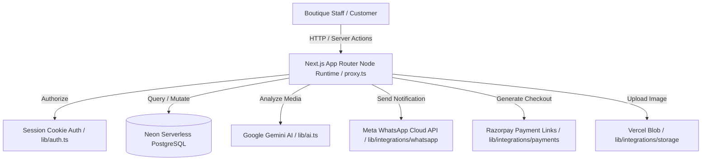

# Jawhara OS V2 - System Architecture

This document describes the high-level system design, database layout, domain design patterns, and integrations of Jawhara OS V2.

---

## 1. System Topology Overview

---

## 2. Core Architectural Pillars

### A. Database Layer (PostgreSQL on Neon)
- **Engine**: Replaced legacy local SQLite database with Neon Serverless PostgreSQL for enterprise concurrency.
- **Money Types**: Money representation mapped strictly to `@prisma/client` `Decimal` objects (mapped to SQL `DECIMAL(12,2)`) to avoid IEEE 754 float precision loss.
- **Deduplication Indirection**: Unique indices placed on `normalizedMobile` inside the `Customer` table to resolve contacts using E.164 phone numbers.
- **Webhook Audits**: A centralized `WebhookEvent` table tracks incoming payloads from Meta and Razorpay. It uses a unique hash index (`externalEventId`) to enforce complete idempotency (preventing duplicate stock allocation or revenue logging).

### B. Concurrency-Safe Domain Model Engine
- **Unique Inventory Lock**: Product reservation employs **conditional database updates** instead of application-level checks. By writing `updateMany` queries checking for `inventoryStatus: 'AVAILABLE'`, we achieve atomic locks under concurrent load. The database returns modified counts of `0` if another salesperson won the reservation, preventing double-bookings.
- **Sequential SKU & Order Identifiers**: Product SKU codes (`JWR-R-26-XXXX`) and order numbers (`ORD-XXXXX`) are generated atomically utilizing increments on a specialized `SequenceCounter` model.

### C. Authentication Middleware (proxy.ts)
- Strictly follows Next.js 16 requirements. 
- Avoids unstable edge-run middlewares. Instead, uses a Node-runtime `proxy.ts` file to validate cookie session keys, block anonymous route queries, and redirect users to `/login`.

### D. Integrations Layer
- **Google GenAI SDK**: Upgraded legacy SDK imports to `@google/genai` client using structured schemas (`responseMimeType: 'application/json'`) to force Gemini to return formatted JSON matching the UI forms.
- **File Asset Storage**: CENTRAL provider (`lib/integrations/storage/provider.ts`) routes file uploads to cloud Vercel Blob storage, falling back to local disk storage (`/public/uploads`) during local development.
- **Outbound WhatsApp Messenger**: Central client manages communications with Meta Graph API, supporting templates and media. Includes a mock provider printing output to console.
- **Razorpay Payments**: API client generates payment links with E.164 normalization, rupee-to-paise conversion, and custom redirects.

### E. Event-Driven Automation Engine (`emitBusinessEvent`)
- Operations publish system events (e.g. `PAYMENT_RECEIVED`, `PRODUCT_INQUIRY_CREATED`) via a centralized broker in `lib/domain/automation.ts`.
- Subscribed rule loops check toggle conditions, lookup pre-approved template mappings, and send transactional WhatsApp templates or text alerts automatically.
